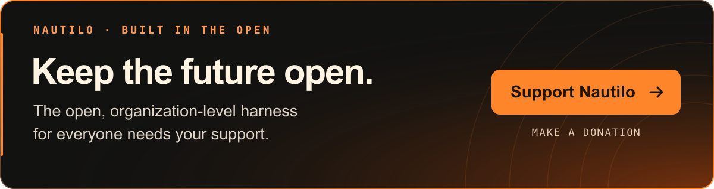

# Nautilo

<div align="center">

[English](README.md) · [Deutsch](README.de.md) · [简体中文](README.zh-CN.md) · [日本語](README.ja.md) · [Français](README.fr.md) · [Español](README.es.md) · [한국어](README.ko.md)

Bebilderte Anleitung für die lokale Einrichtung: [Englisch](https://nautilo.ai/docs/operator/deploy/local) · [简体中文](https://nautilo.ai/docs/operator/deploy/local-zh-cn) · [日本語](https://nautilo.ai/docs/operator/deploy/local-ja) · [Français](https://nautilo.ai/docs/operator/deploy/local-fr) · [Español](https://nautilo.ai/docs/operator/deploy/local-es) · [한국어](https://nautilo.ai/docs/operator/deploy/local-ko)

Die Benutzeroberfläche von Nautilo ist derzeit auf Englisch. Die README und die Anleitung zur lokalen Einrichtung sind übersetzt; andere Dokumentation kann weiterhin auf Englisch sein.

<!-- Translation source: README.md; SHA-256: d9e81d8a699a01fa1836ec768028a4e0c464d4420524b9cae4d0f48686dd855b -->
<!-- Review status: AI-assisted translation; fluent-speaker review pending. -->

### KI wird mehrspielerfähig.

</div>

https://github.com/user-attachments/assets/79a6c37f-ea01-4e95-afd5-85d4b9b55e0d

**Dein eigener Superagent. Deine Leute und ihre Genies. Die Intelligenz gehört dir.**

Lerne dein Genie kennen. Gib deinem Genie eine Persönlichkeit, Erinnerungen,
ein Gesicht und eine Stimme. Schreibt, recherchiert und gestaltet gemeinsam.
Bringe deine Leute und ihre Genies in denselben Room.
Dein Server. Deine Modelle. Deine Regeln. Open Source. Unter der MIT-Lizenz.

## Erste Schritte

**Dein erstes Nautilo. Vom leeren Server zu etwas, das ihr gemeinsam geschaffen habt.**

[](https://nautilo.ai/docs/operator/deploy/local)

### [Lokal auf deinem Mac ausprobieren →](https://nautilo.ai/docs/operator/deploy/local)

Lerne dein Genie kennen, gestalte es nach deinen Vorstellungen und erstellt
gemeinsam euer erstes Dokument. Folge der bebilderten Anleitung.

Du brauchst **Docker Desktop** und **einen API-Schlüssel für ein Modell**.
Nautilo befindet sich in der **Alpha-Phase**.

**Für dein Team:** [In deinem Rechenzentrum oder auf einem VPS bereitstellen →](https://nautilo.ai/docs/operator/deploy/linux-server)

**Du hast bereits einen Server?** [Desktop für Mac herunterladen →](https://nautilo.ai/download/mac) · [Mobile herunterladen →](https://nautilo.ai/download#download-platforms-title)

## Hol deine Leute dazu. Und ihre Genies.

Bringe deine Leute und ihre Genies in denselben Room. Nehmt eine Idee auseinander,
schreibt den ersten Entwurf und schickt ein Genie los, um das fehlende Stück zu
recherchieren. Gib deinem Genie eine Persönlichkeit, mit der du gern Zeit verbringst.

Übernimm dann selbst die Steuerung. Schreibe den Absatz um. Verschiebe den Schriftzug.
Du solltest keinen besseren Prompt brauchen, um ein Wort drei Zoll nach links zu verschieben.

Und behalte die Schlüssel zu deinem eigenen Haus. Du wählst die Modelle, betreibst
den Server und entscheidest, wer Zugriff erhält. Einen Room zu teilen sollte nicht
bedeuten, dein ganzes Leben offenzulegen.

[Modelle und API-Schlüssel](https://nautilo.ai/docs/operator/provider-keys) · [Sicherheit und Datenschutz](https://nautilo.ai/docs/security)

## Orientierung

| Anleitung | Wobei sie dir hilft |
| --- | --- |
| [Dokumentation](https://nautilo.ai/docs) | Finde den passenden Einstieg für Nutzer, Betreiber oder Entwickler. |
| [Nautilo verwenden](https://nautilo.ai/docs/use) | Lerne Rooms, Genies, kreative Werkzeuge und alltägliche Arbeitsabläufe kennen. |
| [Nautilo betreiben](https://nautilo.ai/docs/operator) | Stelle einen Server bereit, konfiguriere, verwalte und warte ihn. |
| [Auf Nautilo aufbauen](https://nautilo.ai/docs/build) | Verstehe die Architektur und entwickle auf Grundlage des Quellcodes. |
| [Skill-Paket](https://nautilo.ai/skills) | Finde Nautilo-Anleitungen für KI-Assistenten. |
| [Gestaltungsprinzipien](https://nautilo.ai/principles) | Verstehe die Entscheidungen, die das Produkt prägen. |
| [Versionierter Dokumentationsindex](DOCS.md) | Finde Quellcode-Verträge, Paketierung, Veröffentlichungen und Betriebsanleitungen. |

## Den Quellcode erkunden

Dieses Monorepo enthält die Anwendungen und gemeinsamen Pakete, aus denen Nautilo
besteht. Die Links führen direkt zu dem Teil, den du verstehen oder ändern möchtest.

### Anwendungen

| Anwendung | Aufgabe |
| --- | --- |
| [Workbench](apps/workbench) | Die gemeinsame Browser-Oberfläche, die auch in Desktop verwendet wird. |
| [Desktop](apps/desktop/README.md) | Electron-Client, Integration des lokalen Arbeitsplatzes und Paketierung. |
| [Mobile](apps/mobile/README.md) | Der mobile Client auf Grundlage von React Native und Expo. |
| [CLI](apps/cli/README.md) | Bereitstellung und Verwaltung von Servern über das Terminal. |
| [Mitgelieferte Anwendungen](packages/first-party-apps) | Gebündelte kreative Anwendungen: [Writer](packages/first-party-apps/writer), [Sheets](packages/first-party-apps/spreadsheet), [Slides](packages/first-party-apps/presentation), [Board](packages/first-party-apps/board), [Design](packages/first-party-apps/design), [Video](packages/first-party-apps/video). |

### Kernpakete

| Paket | Inhalt |
| --- | --- |
| [Agent](packages/agent) | Agenten-Graphen, Prompts, Modellanbieter und [integrierte Werkzeuge](packages/agent/src/tools/register-all.ts). |
| [Runtime](packages/runtime) | Koordination von Gesprächen, Ausführung von Aufgaben, Hintergrundaufträge, Sitzungen und Ereignisse. |
| [Server](packages/server) | HTTP- und WebSocket-APIs auf Grundlage von Fastify für die Clients. |
| [Datenbank](packages/db) | Drizzle-Schema, Migrationen und dauerhafte Speicherung. |
| [Reflection](packages/reflection) / [Reflection-Bridge](packages/reflection-bridge) | Reflexion über Erinnerungen und ihre Integration in Nautilo. |
| [Lattice-Bridge](packages/lattice-bridge) / [Lattice-Kryptografie](packages/lattice-crypto) | Integration verschlüsselter Erinnerungen und kryptografische Grundbausteine. |
| [Trust](packages/trust) / [Security](packages/security) | Identität, Berechtigungen, Regeln für Werkzeuge und Sicherheitskontrollen für Aktionen. |
| [Relay](packages/relay) / [Computer Use Host](packages/computer-use-host) | Ausführung auf verbundenen Arbeitsplätzen und Desktop-Automatisierung. |
| [Werkzeugkatalog](packages/catalog) / [MCP-Client](packages/mcp-client) | Erkennung und Registrierung von Werkzeugen sowie MCP-Verbindungen. |
| [API-Client](packages/api-client) / [Echtzeit-Client](packages/realtime-client) | Gemeinsame Transportfunktionen der Clients. |
| [Typen](packages/types) / [Workbench-Komponenten](packages/workbench-components) | Gemeinsame Verträge und Komponenten der Benutzeroberfläche. |

Informationen zu Bereitstellung und Wartung findest du unter [Bereitstellung](deploy/README.md),
[Compose-Treiber](deploy/compose-driver/README.md),
[Paketierung](packaging) und [Betrieb](ops/README.md).
Die [Anwendungs-Bridge](docs/genie-application-bridge.md) erklärt, wie Genies
mit den Oberflächen der Anwendungen interagieren.

## Aus dem Quellcode entwickeln

Das Repository legt **Bun 1.3.11** und **Node 24.x** als Versionen fest. Installiere
Docker für die lokale PostgreSQL- und Logto-Infrastruktur. Zur Vorbereitung von
Desktop kann außerdem Rust für das native Hilfsprogramm erforderlich sein.

```bash
git clone https://github.com/agentsea/nautilo.git
cd nautilo
bun install --frozen-lockfile
bun run dev-stack --instance my-nautilo-dev
```

Wähle einen noch nicht verwendeten Instanznamen für eine neue Umgebung. Lass dieses
Terminal weiterlaufen und folge dann der [Anleitung zur lokalen Entwicklung aus dem Quellcode](https://nautilo.ai/docs/build/development/local-development),
um die Instanz zu übernehmen, ein Modell zu konfigurieren und einen Client zu
verbinden. Die Anleitung behandelt auch bestehende Instanzen, isolierte Klone
und Desktop-Profile.

Führe vor dem Einreichen einer Codeänderung die dafür geeigneten Prüfungen aus.
Die Standardprüfungen für das Repository sind:

```bash
bun run lint
bun run typecheck
bun run test:unit
bun run lint:unused
```

Die [Testanleitung](https://nautilo.ai/docs/build/development/testing) beschreibt
gezielte Prüfungen und die Anforderungen für Integrationstests. Programmierassistenten
sollten vor Änderungen [AGENTS.md](AGENTS.md) und [README.ai](README.ai) lesen.

## Hilf bei der Weiterentwicklung

Es gibt noch sehr viel zu erfinden. Bring das ein, was du besser verstehst als
alle anderen: den mühsamen Arbeitsablauf, mit dem du seit Jahren kämpfst, das
Gestaltungsdetail, das dich immer wieder stört, oder den Fehler, den du nicht
einfach hinnehmen wolltest. Diese Erfahrung und Urteilskraft wünschen wir uns
für das Projekt.

Kleine Korrekturen sind willkommen. Beginne bei größeren Änderungen mit dem
Problem und stimme den Entwurf ab, bevor du mit der Umsetzung anfängst. Ein Berg
generierten Codes macht eine unklare Idee nicht klarer. Ein gut verstandenes
Problem gibt uns eine Richtung.

Lies die [Hinweise zum Mitwirken](CONTRIBUTING.md), erkunde die
[ausgewählten Probleme](https://nautilo.ai/community/problems) oder finde
[Hilfe und Unterstützung](https://nautilo.ai/community/support).
Melde Sicherheitslücken vertraulich gemäß [SECURITY.md](SECURITY.md).

## Lizenz

Nautilo steht unter der [MIT-Lizenz](LICENSE). Die
[Hinweise zu Drittanbietern](THIRD_PARTY_NOTICES.md) enthalten die Lizenzen der
Abhängigkeiten und Angaben zur Urheberschaft. Die [Herkunftsnachweise der Inhalte](ASSET_PROVENANCE.md)
behandeln Grafiken, generierte Medien und Dokument-Testdaten.

[](https://github.com/sponsors/agentsea)

[Unterstütze Nautilo über agentsea auf GitHub Sponsors](https://github.com/sponsors/agentsea) · Einmalig oder monatlich.

[](https://hoodscan.co/token/0xddd4947010496b500abe96ab0965c38584413ba3)

Open Source lebt von Menschen, die einander unterstützen. Die Bankr-Community
hat einen unabhängigen [Nautilo-Token](https://hoodscan.co/token/0xddd4947010496b500abe96ab0965c38584413ba3)
geschaffen und einen Teil seiner Handelsgebühren zur Unterstützung unserer Arbeit
bereitgestellt. Danke, dass ihr uns helft, die Entwicklung fortzusetzen.

Dies ist ein Community-Token, der weder von Nautilo herausgegeben noch von Nautilo
befürwortet wird. Er hat keine Funktion in der Software und gewährt keine Produkt-,
Eigentums- oder Mitbestimmungsrechte.
