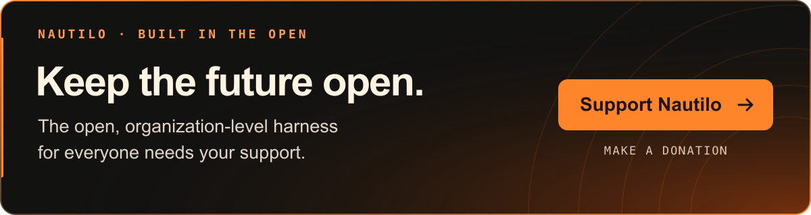

# Nautilo

<div align="center">

[English](README.md) · [简体中文](README.zh-CN.md) · [日本語](README.ja.md) · [Français](README.fr.md) · [Español](README.es.md) · [한국어](README.ko.md)

代码和文档目前以英语编写。欢迎提交翻译 PR；请参阅[翻译贡献指南](CONTRIBUTING.md#translations-and-localization)（英文）。本页为 README 的中文译本，不代表应用界面或链接所指向的文档已支持中文。

<!-- Translation source: README.md; SHA-256: 13cc19ef82a182adb053c02d1d531e6cefc8f3fd9fc3882b393640a33d4c6180 -->
<!-- Review status: AI-assisted translation; fluent-speaker review pending. -->

### AI，进入多人模式。

</div>

https://github.com/user-attachments/assets/79a6c37f-ea01-4e95-afd5-85d4b9b55e0d

**你自己的超级智能体。你在乎的人，还有他们的 Genie。智能，掌握在你手中。**

认识你的 Genie。赋予她个性、记忆、面孔和声音。一起写作、研究、创造。让你的伙伴和他们的 Genie 来到同一间 Room。你的服务器。你的模型。你的规则。开源，采用 MIT 许可证。

<a id="get-started"></a>

## 开始使用

**你的第一个 Nautilo。从空白服务器，到你们一起完成的作品。**

[](https://nautilo.ai/docs/operator/deploy/local)

### [在你的 Mac 上本地试用 →](https://nautilo.ai/docs/operator/deploy/local)

认识你的 Genie，把她打造成你喜欢的样子，一起完成第一份文档。跟着图文指南（英文）开始吧。

你需要 **Docker Desktop** 和**一个模型服务商的 API 密钥**。Nautilo 目前处于 **alpha** 阶段。

**团队使用：**[部署到你的数据中心或 VPS →](https://nautilo.ai/docs/operator/deploy/linux-server)

**已经有服务器？**[下载 Mac 版 Desktop →](https://nautilo.ai/download/mac) · [下载 Mobile →](https://nautilo.ai/download#download-platforms-title)

## 带上你的伙伴，也带上他们的 Genie

让你的伙伴和他们的 Genie 来到同一间 Room。拆解一个想法，写出第一稿，派一位 Genie 去研究缺失的那一块。给你自己的 Genie 一种让你愿意与她相处的个性。

然后，接过控制权。改写那段文字。挪动排版。把一个词往左移几厘米，不该还得琢磨一个更好的提示词。

也别交出自己家的钥匙。模型由你选，服务器由你管，谁能访问由你决定。共享一间 Room，不该意味着交出你的全部生活。

[模型与 API 密钥](https://nautilo.ai/docs/operator/provider-keys) · [安全与隐私](https://nautilo.ai/docs/security)

## 找到你需要的内容

| 指南 | 能帮你做什么 |
| --- | --- |
| [文档](https://nautilo.ai/docs) | 找到适合用户、运维人员或开发者的路线。 |
| [使用 Nautilo](https://nautilo.ai/docs/use) | 了解 Room、Genie、创作工具和日常工作流程。 |
| [运行 Nautilo](https://nautilo.ai/docs/operator) | 部署、配置、管理和维护服务器。 |
| [基于 Nautilo 开发](https://nautilo.ai/docs/build) | 理解架构并基于源码开发。 |
| [技能包](https://nautilo.ai/skills) | 查找供 AI 助手使用的 Nautilo 指南。 |
| [设计原则](https://nautilo.ai/principles) | 理解塑造产品的判断与取舍。 |
| [版本化文档索引](DOCS.md) | 查找源码契约、打包、发布和运维操作手册。 |

<a id="explore-the-code"></a>

## 探索代码

这个 monorepo 包含构成 Nautilo 的应用和共享包。沿着链接，直接找到你想理解或修改的部分。

### 应用

| 应用 | 职责 |
| --- | --- |
| [Workbench](apps/workbench) | 共享的浏览器界面，桌面端也使用它。 |
| [Desktop](apps/desktop/README.md) | Electron 客户端、本地工作站集成与打包。 |
| [Mobile](apps/mobile/README.md) | React Native / Expo 移动客户端。 |
| [CLI](apps/cli/README.md) | 通过终端部署和管理服务器。 |
| [第一方应用](packages/first-party-apps) | 随附的创作应用：[Writer](packages/first-party-apps/writer)、[Sheets](packages/first-party-apps/spreadsheet)、[Slides](packages/first-party-apps/presentation)、[Board](packages/first-party-apps/board)、[Design](packages/first-party-apps/design)、[Video](packages/first-party-apps/video)。 |

### 核心包

| 包 | 内容 |
| --- | --- |
| [Agent](packages/agent) | 智能体图、提示词、模型服务商和[内置工具](packages/agent/src/tools/register-all.ts)。 |
| [Runtime](packages/runtime) | 对话协调、任务执行、作业、会话和事件。 |
| [Server](packages/server) | 为客户端提供服务的 Fastify HTTP 和 WebSocket API。 |
| [Database](packages/db) | Drizzle 数据模型、迁移与持久化。 |
| [Reflection](packages/reflection) / [Reflection bridge](packages/reflection-bridge) | 记忆反思及其与 Nautilo 的集成。 |
| [Lattice bridge](packages/lattice-bridge) / [Lattice crypto](packages/lattice-crypto) | 加密记忆集成与密码学原语。 |
| [Trust](packages/trust) / [Security](packages/security) | 身份、能力、工具策略和操作安全控制。 |
| [Relay](packages/relay) / [Computer Use Host](packages/computer-use-host) | 已连接工作站上的执行与桌面自动化。 |
| [Tool catalog](packages/catalog) / [MCP client](packages/mcp-client) | 工具发现、注册和 MCP 连接。 |
| [API client](packages/api-client) / [Realtime client](packages/realtime-client) | 共享的客户端传输层。 |
| [Types](packages/types) / [Workbench components](packages/workbench-components) | 共享契约和 UI 组件。 |

部署与维护请参阅[部署](deploy/README.md)、[Compose 驱动](deploy/compose-driver/README.md)、[打包](packaging)和[运维](ops/README.md)。[应用桥接文档](docs/genie-application-bridge.md)说明了 Genie 如何与应用界面交互。

<a id="develop-from-source"></a>

## 从源码开发

仓库固定使用 **Bun 1.3.11** 和 **Node 24.x**。安装 Docker，以运行本地 PostgreSQL 和 Logto 基础设施。准备桌面端环境时，还可能需要 Rust 来构建原生辅助程序。

```bash
git clone https://github.com/agentsea/nautilo.git
cd nautilo
bun install --frozen-lockfile
bun run dev-stack --instance my-nautilo-dev
```

为新环境选择一个未使用的实例名称。保持该终端运行，然后按照[源码开发指南](https://nautilo.ai/docs/build/development/local-development)认领实例、配置模型并连接客户端。该指南也介绍了现有实例、隔离克隆和桌面端配置档案。

提交代码修改前，运行适合该改动的检查。仓库的标准检查包括：

```bash
bun run lint
bun run typecheck
bun run test:unit
bun run lint:unused
```

针对性检查和集成要求请参阅[测试指南](https://nautilo.ai/docs/build/development/testing)。编程助手在修改前应阅读 [AGENTS.md](AGENTS.md) 和 [README.ai](README.ai)。

## 一起把它做出来

还有太多东西等待创造。带来你最懂的东西：折磨你多年的糟糕工作流程、一直让你不舒服的设计细节，或者那个你不肯放过的 bug。我们希望项目里有你的判断。

欢迎小幅修正。对于较大的改动，先说清问题，再就设计达成一致，然后动手。堆成山的生成代码不会让一个模糊的想法变清楚。真正理解问题，才能找到前进的方向。

阅读[贡献指南](CONTRIBUTING.md)，探索[精选问题](https://nautilo.ai/community/problems)，或寻找[帮助与支持](https://nautilo.ai/community/support)。请按照 [SECURITY.md](SECURITY.md) 私下报告安全漏洞。

## 许可证

Nautilo 采用 [MIT 许可证](LICENSE)。依赖项的许可证与署名请参阅[第三方声明](THIRD_PARTY_NOTICES.md)；美术资源、生成媒体和文档测试素材的来源请参阅[资源来源说明](ASSET_PROVENANCE.md)。

[](https://github.com/sponsors/agentsea)

[通过 GitHub Sponsors 上的 agentsea 支持 Nautilo](https://github.com/sponsors/agentsea) · 一次性或按月赞助。
